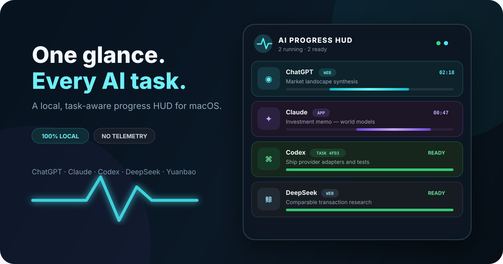
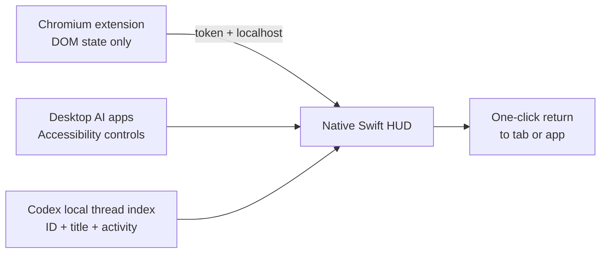

<div align="center">



# AI Progress HUD

### One glance. Every AI task.

Track ChatGPT, Claude, Codex, DeepSeek, and Yuanbao without breaking focus.

[](https://www.apple.com/macos/)
[](https://www.swift.org/)
[](SECURITY.md)
[](LICENSE)

[Download](../../releases/latest) · [Quick start](#quick-start) · [Install guide](docs/INSTALLATION.md) · [中文](README.zh-CN.md) · [Roadmap](PRODUCT_ROADMAP.md)

</div>

AI Progress HUD is a tiny native macOS overlay for people who run several AI tasks at once. It shows **which AI**, **which task**, **what state**, and **how long it has been running**—then takes you back to the right tab, app, or Codex task with one click.

Unlike coding-agent-only monitors, it covers everyday AI webpages, desktop clients, and parallel Codex threads in one privacy-first HUD.

## Why it exists

You should not have to cycle through five windows just to learn whether an answer is still generating.

- **Glanceable, not distracting** — compact game-style activity bars stay at the screen edge.
- **Task-aware** — two parallel Codex threads become two named rows, not one generic “Codex running” light.
- **Honest progress** — states and elapsed time, never a fabricated percentage.
- **Local by design** — no account, cloud backend, telemetry, prompt capture, or response storage.
- **Useful beyond coding** — monitor research, writing, analysis, and coding tasks across major AI products.

## What you get

- A always-on-top HUD that can sit at the edge of your screen without stealing focus.
- Honest state labels: **Standby**, **Thinking**, **Streaming**, **Completed**, **Needs action**, **Error**, or **Disconnected**.
- Per-provider detection toggles so you can decide exactly which AIs belong in the HUD.
- One-click return to browser tabs, desktop apps, and best-effort Codex task selection.
- A local pairing model: browser extension → `127.0.0.1` → native HUD.

## Supported sources

| Provider | Web | Desktop | Parallel task identity | Click to return |
|---|:---:|:---:|:---:|:---:|
| ChatGPT | ✅ Chromium | ✅ macOS | Browser tab / window | ✅ |
| Claude | ✅ Chromium | ✅ macOS | Browser tab / window | ✅ |
| Codex | — | ✅ macOS | **Conversation title** | ✅ |
| DeepSeek | ✅ Chromium | Experimental desktop detection | Browser tab | ✅ |
| Yuanbao | ✅ Chromium | ✅ macOS | Browser tab / window | ✅ |

Web support covers Chrome, Edge, Arc, and other Chromium browsers. Safari is on the roadmap.

For detailed behavior, limitations, and adapter health, see the [support matrix](docs/SUPPORT_MATRIX.md).

## Quick start

### 1. Install the macOS app

Download the latest `.dmg` or `.zip` from [Releases](../../releases/latest), move **AI Progress HUD** to Applications, and launch it.

> Current community builds are ad-hoc signed. On first launch, right-click the app and choose **Open**. A notarized distribution is on the release roadmap.

Build from source instead:

```bash
git clone <your-fork-or-repository-url>
cd ai-progress-hud
make test
make package
open "AI Progress HUD.app"
```

### 2. Connect browser AI tabs

1. Open `chrome://extensions` and enable **Developer mode**.
2. Choose **Load unpacked** and select the bundled `Extension` folder.
3. Open HUD settings, copy the pairing token, and save it in the extension.
4. Already-open ChatGPT, Claude, DeepSeek, and Yuanbao tabs are injected automatically.

### 3. Enable desktop app detection

Open HUD settings and grant **Accessibility** permission. The app reads window titles and control labels to determine whether a desktop AI is on standby, thinking, streaming, or blocked. It never stores the conversation body.

Codex parallel-thread monitoring uses the local Codex thread index and does not require Accessibility permission.

For a screenshot-by-screenshot setup path, use the full [installation guide](docs/INSTALLATION.md). If something looks wrong, start with [Troubleshooting](docs/TROUBLESHOOTING.md) or the [FAQ](docs/FAQ.md).

## State model

| State | Meaning |
|---|---|
| Standby | The AI surface exists but is idle |
| Thinking | The request was accepted and generation has not started streaming |
| Streaming | Output is actively changing |
| Completed | A new result is ready to inspect |
| Needs action | Permission, login, verification, or user approval is required |
| Error / disconnected | The source failed or stopped sending heartbeats |

Running bars use motion rather than fake completion percentages. Completed rows remain highlighted until opened.

## How it works



- The local bridge listens only on `127.0.0.1:17321` and requires a random pairing token.
- Browser events contain provider, tab ID, title, state, and timestamps—never prompt or response text.
- Each provider is an isolated adapter, so website changes can be fixed without rewriting the HUD.
- A single-instance lock prevents duplicate apps from fighting over the local bridge.

Read the full [architecture](docs/ARCHITECTURE.md) and [privacy model](docs/PRIVACY.md).

## Development

Requirements: macOS 13+, Xcode Command Line Tools, Swift 6, and Node.js for extension syntax checks.

```bash
make build      # debug build
make test       # Swift tests
make lint       # extension + plist validation
make package    # local .app
make release    # .zip + .dmg + SHA256SUMS
```

Project docs:

- [Architecture](docs/ARCHITECTURE.md)
- [Privacy model](docs/PRIVACY.md)
- [Support matrix](docs/SUPPORT_MATRIX.md)
- [Installation](docs/INSTALLATION.md)
- [FAQ](docs/FAQ.md)
- [Troubleshooting](docs/TROUBLESHOOTING.md)
- [Release checklist](docs/RELEASE_CHECKLIST.md)

## Contributing

The highest-impact contributions are new provider adapters, selector fixes after website updates, reproducible state-detection tests, localization, and signed release automation. See [CONTRIBUTING.md](CONTRIBUTING.md).

- Found a broken website adapter? Use the **Adapter broken** issue template.
- Want another AI provider? Open a feature request with its URL/app bundle ID and observable states.
- Security or privacy concern? Follow [SECURITY.md](SECURITY.md), not a public issue.

If this makes parallel AI work calmer, a ⭐ helps other multi-AI users discover it.

## License

MIT © AI Progress HUD contributors.
